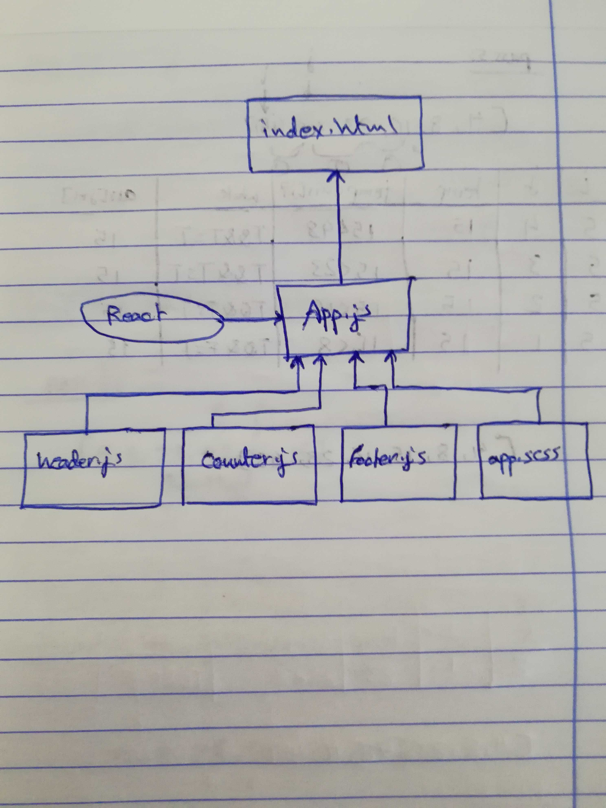

# LAB - Class 26

## Component Based UI

### Author: Ahmad K. Al-Mahasneh

### Links and Resources

- [submission PR](https://github.com/401-advanced-javascript-AhmadK/component-based-UI/pull/1)

#### How to initialize/run your application (where applicable)

- `npm run start`

#### Tests

- No Tests are used

#### UML

